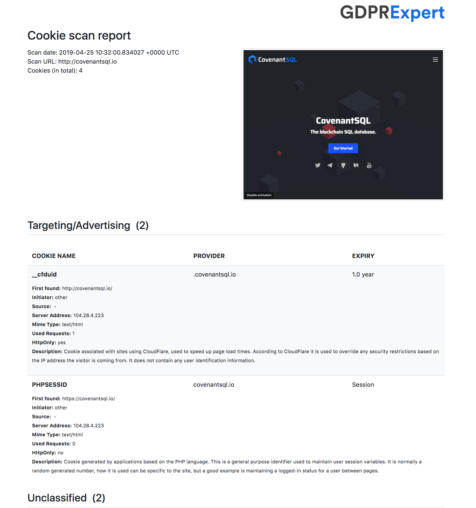

# Cookie Tester

GDPR requires that all websites that provide services to European users must provide a complete report on the use of cookies to record user information and continue to use it with the express consent of the user.
There are several commercial Cookie Scanner online.

But we decide to make our implementation Open Source. Hope to help more people getting aware of the privacy problems.

Cookie Tester is a simple utility to analyze website cookie status and generate reports for GDPR-compliance.

For how to use the "Cookie Database", please see [CQL QuickStart](https://developers.covenantsql.io/docs/en/quickstart)

<p align="center">
   <a href="./example/reddit-cookie.pdf"> </a>
   <a href="./example/amazon-cookie.pdf"> </a>
   <a href="./example/netflix-cookie.pdf"> </a>
   <a href="./example/ebay-cookie.pdf"> </a>
</p>

### Features

1. Nice HTML or PDF report

1. Detailed cookie description

1. We collected more than 10000 cookie description and put them in free DB service CQL:

  - DSN: covenantsql://050cdf3b860c699524bf6f6dce28c4f3e8282ac58b0e410eb340195c379adc3a
  - [Config & Key](./config)


### Online Demo

Your can just try Cookie Tester on [gdprExpert.io](https://gdprexpert.io/)

### Installation

Requires MacOS/Linux system.

First, install [`Google Chrome`](https://www.google.com/chrome/) in your operating system.
Or you can start a headless Chrome in docker with

```shell
$ docker container run -d -p 9222:9222 zenika/alpine-chrome --no-sandbox \ 
 --remote-debugging-address=0.0.0.0 --remote-debugging-port=9222
```

Then, install the `CookieTester` using `go get`.

```shell
$ go get github.com/CovenantSQL/CookieTester
```

### Usage

CookieTester is capable of geneating reports in `json/html/pdf` format.

```
$ CookieTester --help
usage: CookieTester [<flags>] <command> [<args> ...]

website cookie usage report generator

Flags:
  --help                   Show context-sensitive help (also try --help-long
                           and --help-man).
  --chrome=CHROME          chrome application to run as remote debugger
  --verbose                run debugger in verbose mode
  --timeout=1m0s           timeout for a single cookie scan
  --wait=WAIT              wait duration after page load in scan
  --classifier=CLASSIFIER  classifier database for cookie report
  --log-level=LOG-LEVEL    set log level

Commands:
  help [<command>...]
    Show help.

  cli [<flags>] <site>
    generate report for a single website

  version
    get debugger version

  server [<flags>]
    start a report generation server

$ CookieTester cli --help
usage: CookieTester cli [<flags>] <site>

generate report for a single website

Flags:
  --help                   Show context-sensitive help (also try --help-long
                           and --help-man).
  --chrome=CHROME          chrome application to run as remote debugger
  --verbose                run debugger in verbose mode
  --timeout=1m0s           timeout for a single cookie scan
  --wait=WAIT              wait duration after page load in scan
  --classifier=CLASSIFIER  classifier database for cookie report
  --log-level=LOG-LEVEL    set log level
  --headless               run chrome in headless mode
  --port=9222              chrome remote debugger listen port
  --json                   print report as json
  --html=HTML              save report as html
  --pdf=PDF                save report as pdf

Args:
  <site>  site url
```

### Examples

Generate HTML report for `covenantsql.io` using cli mode.

```shell
$ CookieTester cli \
    --headless \
    --classifier "covenantsql://050cdf3b860c699524bf6f6dce28c4f3e8282ac58b0e410eb340195c379adc3a?config=./config/config.yaml" \
    --html cql.html covenantsql.io
```

Just wait for a while, you will found `cql.html` showing results like this:



